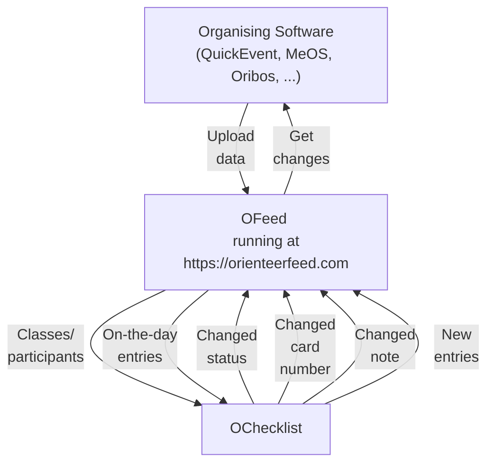

# About

A modern IOF-XML–oriented platform for managing all orienteering event data in one place. Developed as an open-source project and hosted at [orienteerfeed.com](https://orienteerfeed.com).

The platform also has a specialized app, [MRB](/tutorials/visualize-data#2-mrb), for modern and interactive results visualization.

## Key benefits of using the platform

- `Smooth readout` - no **unknown** cards that **slow down** read-out.
- `Actual card numbers` - changed card numbers at the start can be **processed within a minute** and radio controls work for all competitors. The work involved in installing radio controls will not be **wasted**.
- `Real-time data` - [O Checklist](https://play.google.com/store/apps/details?id=se.tg3.startlist) app has up-to-date data, so that even **late entries** during the race and **other changes** are synchronized **before** the competitor enters the first corridor.
- `Instant DNS` - competitors who didn’t start can be processed quickly. If a late start occurs, the **DNS** status is changed back to **Active**. You have accurate statistics of who is still running.

## Workflow

## Data inputs

Store all event data:

- Start lists
- Results
- Changes from the start captured by the [O Checklist](https://play.google.com/store/apps/details?id=se.tg3.startlist) mobile app
- New entries

## Limitations

Real-time data synchronization requires **mobile network availability** at both the event center and the start.

## Community

Connecting the right people is essential, which is why we have launched a [Discord server](https://discord.gg/QMvnurgKzU), where you can seek advice and learn about other useful tools. Join us and help us make OFeed a popular platform that will make organizing easier not only for us, but for you as well.

## Integrations

Data from the platform can be easily integrated into your app through dedicated API endpoints in both directions. List of already supported apps is [here](/integrations).

## Public Appearances

- Methodical Seminar for Coaches and Referees [recording](https://metodika.ceskyorientak.cz/materialy/444-metodicky-seminar-rozhodcich-2025-o-checklist-po-roce)

## Progresive web application (PWA)

OFeed supports PWA, and the site can be installed via a pop-up window. The installed app provides a smoother browsing experience and can be launched directly from your home screen.

