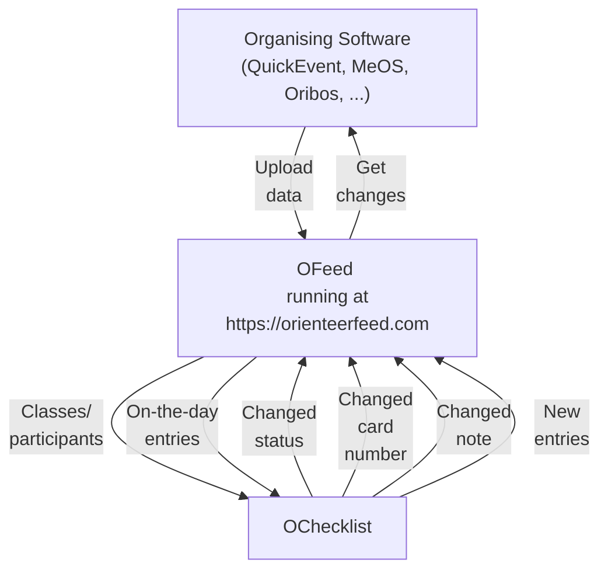

# About

A modern IOF-XML–oriented platform for managing all orienteering event data in one place. Developed as an open-source project and hosted at [orienteerfeed.com](https://orienteerfeed.com).

Store all event data:

- Start lists
- Results
- Changes from the start captured by the [OChecklist](https://stigning.se/checklist/help_en.html) mobile app
- New entries

The platform also has a specialized app, [MRB](/tutorials/visualize-data#2-mrb), for modern and interactive results visualization. For more information, click the link.

## Workflow

### Main Use Cases

- **Real-time** data at the start in the OChecklist app, so that even late entries and card changes are handled before the competitor enters the first corridor
- Changed card numbers at the start can be processed within a minute, and radiocontrols work for all competitors. No more unknown card numbers
- Competitors who didn’t start can be processed quickly. If a late start occurs, the `DNS` status is changed back to `Active`

### Limitations

Real-time data synchronization requires mobile network availability at both the event center and the start.

## Community

We have launched a Discord server ([invite](https://discord.gg/QMvnurgKzU)) that is open to anyone who wants to share their experiences or seek support with using the OFeed platform. Join us and help make OFeed one of the best tools for managing orienteering event data.

## Integration

Data from the platform can be easily integrated into your app through dedicated API endpoints in both directions

### OChecklist

OFeed is fully integrated into the OChecklist mobile app and can be used as a [data source](/tutorials/ochecklist). Data is loaded at the start and updated regularly as you make changes in your organizing software. The start crew has access to up-to-date information throughout the event, and any changes at the start are transferred back to the OFeed platform for further processing.

### SI-Droid Event

A mobile app called `SI-Droid OFeed Connector` is published as an open-source [project](https://github.com/orienteerfeed/ofeed-sidroid-connector) and handles XML uploads to the OFeed platform using the `Results Service` running in `SI-Droid Event`. This allows the readout process of your event to be managed easily on your mobile device.

### APIs

The service provides both [RESTful](https://api.orienteerfeed.com/api-docs/) and [GraphQL](https://api.orienteerfeed.com/graphql) APIs, which are more reliable than standard IOF XML with its many different implementations. It is designed for easy integration of the OFeed platform into your app.

## Public Appearances

- Methodical Seminar for Coaches and Referees [recording](https://metodika.ceskyorientak.cz/materialy/444-metodicky-seminar-rozhodcich-2025-o-checklist-po-roce)

## Progresive web application (PWA)

OFeed supports PWA, and the site can be installed via a pop-up window. The installed app provides a smoother browsing experience and can be launched directly from your home screen

