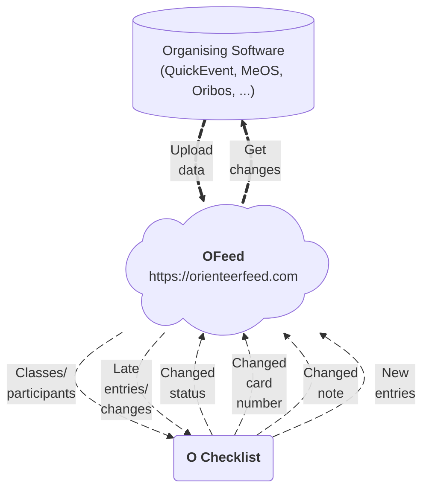

# About

A modern IOF-XML–oriented platform for managing all orienteering event data in one place. Developed as an open-source project and hosted at [orienteerfeed.com](https://orienteerfeed.com).

The platform also has a [specialized app](/features/visualize-data#2-mrb) for modern and interactive start list/results visualization.

## Key benefits of using the platform

- `Smooth readout` - no **unknown** cards that **slow down** read-out.
- `Actual card numbers` - changed card numbers at the start can be **processed within a minute** and radio controls work for all competitors. The work involved in installing radio controls will not be **wasted**.
- `Real-time data` - [O Checklist](https://play.google.com/store/apps/details?id=se.tg3.startlist) app has up-to-date data, so that even **late entries** during the race and **other changes** are synchronized **before** the competitor enters the first corridor.
- `Instant DNS` - competitors who **didn’t start** can be processed **quickly**. If a late start occurs, the **DNS** status is changed back to **Active**. You have accurate statistics of who is still running.
- `Central Data Hub` - keep **all** your orienteering **data** in one secure place when organizing, where it's easily **accessible** to other integrated applications.

## Workflow

A detailed description of the platform itself and the features it offers can be found [👉](/category/features).

## Community

Connecting the right people is essential, which is why we have launched a [Discord server](https://discord.gg/QMvnurgKzU), where you can seek advice and learn about other useful tools. Join us and help us make OFeed a popular platform that will make organizing easier not only for us, but for you as well.

## Integrations

A list of apps integrated with `OFeed`.
| Supported | App | Version | Details |
|--|--|--|--|
| ✅ | O Checklist | >= 5.0 | [link](/integrations/ochecklist) |
| ✅ | QuickEvent | >= 3.0 | [link](/integrations/quickevent) |
| ✅ | SI-Droid Event | all | [link](/integrations/joja) |
| ✅ | O-Pal | all | [link](/integrations/joja) |
| ❌ | MeOS | -- | [link](/integrations/meos) |

Data from the platform can be easily integrated into your app through dedicated API endpoints in both directions. List of already supported apps is [👉](/category/integrations).

### Custom

Can you simply create your own connection. `OFeed` provides both [RESTful](/integrations/rest-api) and [GraphQL](/integrations/graphql) APIs, which are more reliable than standard IOF XML with its many different implementations.

## Support for platform operation

`OFeed` is an open-source project created by a community of organizers, developers, and orienteering enthusiasts. Support for the project is not just about finances — **time**, **knowledge**, and **experience** are just as important. You're wondering how to **get involved**?

### Financial support 💰

**Operating** the platform in the cloud (servers, domains, monitoring, backups) and further development involve **long-term** costs.
If you use `OFeed` or find it **helpful** in organizing races, you can also support its operation and development **financially**:

- with a **one-time** contribution
- with **regular** support
- with support from a **club** or **organizer**

### Development and technical support 💻

You can get directly involved in the development of the platform:

- by contributing **code** (bug fixes, new features, refactoring)
- by testing and providing feedback from **organized** events
- by documenting and improving the **instructions**

You can find the project repositories and information on how to get involved on [GitHub](https://github.com/orienteerfeed).

You can find ways to get involved [👉](/contribute).

### Why get involved? 🌟

Supporting `OFeedu` helps:

- keep the platform available **in the long term**
- **expand** support for other applications and formats
- **simplify** the work of race organizers
- build an **open** ecosystem of tools for orienteering sports

**Any** form of support is meaningful – whether you contribute code, ideas, testing, or financially.
Thank you for helping `OFeed` move forward ❤️.
