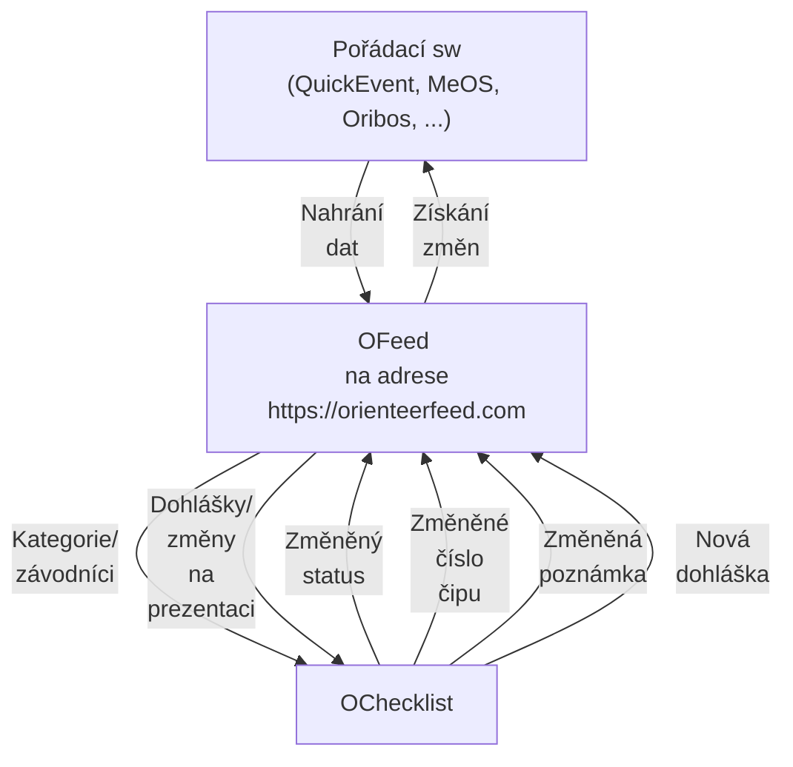

# Představení

Moderní platforma podporující IOF XML pro správu všech dat o závodě na jednom místě. Vyvíjena jako open-source a hostována na adrese [orienteerfeed.com](https://orienteerfeed.com).

Součástí platformy je i vizualizační aplikace [MRB](/tutorials/visualize-data#2-mrb) pro snadnou a moderní vizualizaci startovek/výsledků.

## Hlavní přínosy použítí

- `Hladký průběh vyčítání` - víš, kdo s jakým čipem vystartoval a tak vyčítací frontu **neznámý** čip již **nezpomalí**
- `Skutečná čísla čipů` - změny čísel čipů na startu se snadno dostanou zpět do **pořádacího programu** a tak se nenastane, že by nefungovaly radiokontroly. Práce s instalací radiokontrol nepřijde **nazmar**.
- `Aktuální data` - [O Checklist](https://play.google.com/store/apps/details?id=se.tg3.startlist) si **sám** stáhne provedené **změny** před závodem i **dohlášky** během závodu. Data jsou na startu **dřív**, než samotný závodník vstoupí do prvního koridoru.
- `Okamžité DNS` - závodníky co nedorazí na start je možné **okamžitě** označit jako nestartující. Případný pozdní start změnu zruší. Máš tak **jasný přehled**, kdo je ještě na trati.

## Schéma

## Datové vstupy

Data, se kterými platforma pracuje:

- Startovky
- Výsledky
- Změny ze startu zaznamenané v mobilní aplikaci [O Checklist](https://play.google.com/store/apps/details?id=se.tg3.startlist)
- Dohlášky

## Omezení

Synchronizace dat v reálném čase vyžaduje **dostupné mobilní připojení** k internetu jak v centru závodu, tak na startu.

## Komunita

Propojování správných lidí je základ a proto jsme spustili [Discord server](https://discord.gg/QMvnurgKzU), kde se můžeš poradit i rozšířit povědomí o dalších šikovných nástrojích. Připoj se k nám a pomoz nám udělat z OFeedu oblíbenou platformu co usnadní práci při pořádání nejen nám, ale i tobě.

## Integrace

Nahraná data jsou snadno přístupná dalším aplikacím pomocí připraveného aplikačního rozhraní (API). Seznam již propojených aplikací najdeš [zde](/integrations).

## Zmínky o platformě

- Metodický seminář trenérů a rozhodčích [nahrávka](https://metodika.ceskyorientak.cz/materialy/444-metodicky-seminar-rozhodcich-2025-o-checklist-po-roce)

## Progresive web application (PWA)

Slouží pro rychlejší přístup a příjemnější prohlížení dat. První návštěva webu sama vyvolá nabídku k instalaci aplikace, která následně umožní přímé spuštění z domovské obrazovky tvého zařízení.

