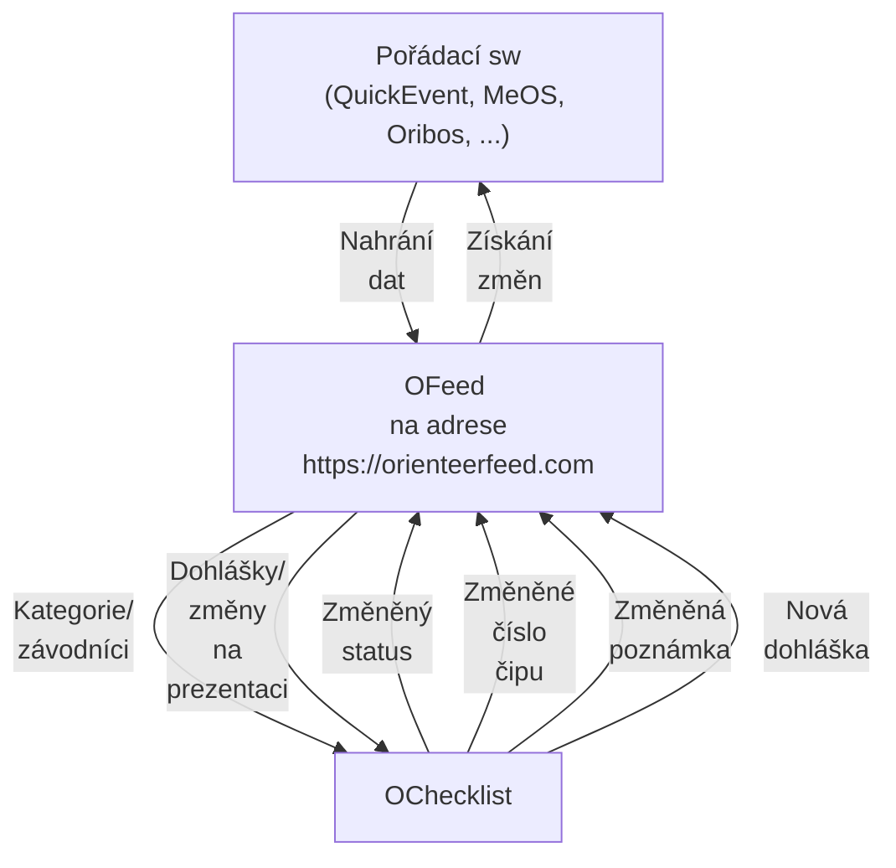

# Představení

Moderní platforma podporující IOF XML pro správu všech dat o závodě na jednom místě. Vyvíjena jako open-source a hostována na adrese [orienteerfeed.com](https://orienteerfeed.com).

Data, se kterými platforma pracuje:

- Startovky
- Výsledky
- Změny ze startu zaznamenané v mobilní aplikaci [OChecklist](https://stigning.se/checklist/help_en.html)
- Dohlášky

Součástí platformy je i vizualizační aplikace [MRB](/tutorials/visualize-data#2-mrb) pro snadnou a moderní vizualizaci startovek/výsledků. Víc informací po kliknutí na odkaz.

## Schéma

### Hlavní využití

- aktuální data v aplikaci OChecklist, takže i změny čipů před závodem a dohlášky jsou na startu dřív, než samotný závodník vstoupí do prvního koridoru
- změny čísel čipů se ze startu snadno dostanou zpět do pořádacího sw a tak se nenastane, že by byl na trati závodník s neznámým čipem, o kterém bychom nevěděli z radiokontrol
- závodníky co nedorazí na start je možné okamžitě označit za DNS. Případný pozdní start změnu zruší.

### Omezení

Synchronizace dat v reálném čase vyžaduje dostupné mobilní připojení k internetu jak v centru závodu, tak na startu.

## Komunita

Spustili jsme vlastní [Discord server](https://discord.gg/QMvnurgKzU), který usnadňuje propojení lidí okolo platformy a dostupnější podporu v případě potřeby. Připoj se k nám a pomoz nám udělat z OFeedu oblíbenou platformu co usnadní práci při pořádání.

## Integrace

Nahraná data jsou snadno přístupná dalším aplikacím pomocí připraveného aplikačního rozhraní (API). Seznam již propojených aplikací nalezneš [zde](/integrations).

## Zmínky o platformě

- Metodický seminář trenérů a rozhodčích [nahrávka](https://metodika.ceskyorientak.cz/materialy/444-metodicky-seminar-rozhodcich-2025-o-checklist-po-roce)

## Progresive web application (PWA)

Slouží pro rychlejší přístup a příjemnější prohlížení dat. První návštěva webu sama vyvolá nabídku k instalaci aplikace, která následně umožní přímé spuštění z domovské obrazovky vašeho zařízení.

