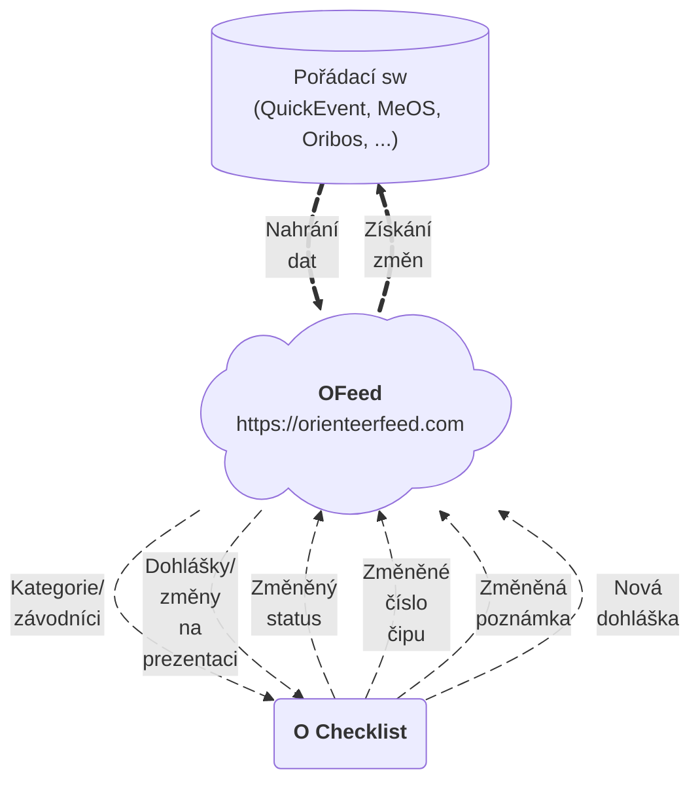

# Představení

Moderní platforma podporující IOF XML pro správu všech dat o závodě na jednom místě. Vyvíjena jako open-source a hostována na adrese [orienteerfeed.com](https://orienteerfeed.com).

Součástí platformy je i [vizualizační aplikace](/features/visualize-data#2-mrb) pro snadnou a moderní vizualizaci startovek/výsledků.

## Hlavní přínosy použítí

- `Hladký průběh vyčítání` - **víš**, kdo s jakým čipem vystartoval a tak vyčítací frontu **neznámý** čip již **nezpomalí**
- `Skutečná čísla čipů` - **změny** čísel čipů na startu se snadno dostanou zpět do **pořádacího programu** a tak se nenastane, že by nefungovaly radiokontroly. Práce s instalací radiokontrol nepřijde **nazmar**.
- `Aktuální data` - [O Checklist](https://play.google.com/store/apps/details?id=se.tg3.startlist) si **sám** stáhne provedené **změny** před závodem i **dohlášky** během závodu. Data jsou na startu **dřív**, než samotný závodník vstoupí do prvního koridoru.
- `Okamžité DNS` - závodníky co **nedorazí** na start je možné **okamžitě** označit jako nestartující. Případný pozdní start změnu zruší. Máš tak **jasný přehled**, kdo je ještě na trati.
- `Centrální úložiště dat` - měj **všechna** orienťácká **data** k pořádání na jednom bezpečném místě, odkud jsou jednoduše **dostupná** dalším integrujícím aplikacím.

## Schéma

Podrobný popis samostné platformy a funkcí co přináší najdeš [👉](/category/features).

## Komunita

Propojování správných lidí je základ a proto jsme spustili [Discord server](https://discord.gg/QMvnurgKzU), kde se můžeš poradit i rozšířit povědomí o dalších šikovných nástrojích. Připoj se k nám a pomoz nám udělat z OFeedu oblíbenou platformu co usnadní práci při pořádání nejen nám, ale i tobě.

## Integrace

Seznam Integrovaných aplikací s `OFeedem`.
| Podporované | Aplikace | Verze | Podrobnosti |
|--|--|--|--|
| ✅ | O Checklist | >= 5.0 | [odkaz](/integrations/ochecklist) |
| ✅ | QuickEvent | >= 3.0 | [odkaz](/integrations/quickevent) |
| ✅ | SI-Droid Event | all | [odkaz](/integrations/joja) |
| ✅ | O-Pal | all | [odkaz](/integrations/joja) |
| ❌ | MeOS | -- | [odkaz](/integrations/meos) |

Nahraná data jsou snadno přístupná dalším aplikacím pomocí připraveného aplikačního rozhraní (API). Seznam již propojených aplikací najdeš [👉](/category/integrations).

### Vlastní

Můžeš si snadno připojit vlastní aplikaci. `OFeed` má k dispozici [REST API](/integrations/rest-api) a [GraphQL](/integrations/graphql), které je jednodušeji uchopitelné v porovnání s **IOF XML** s mnoha rozdílnými implementacemi.

## Podpora provozu platformy

`OFeed` je open-source projekt, který vzniká díky komunitě pořadatelů, vývojářů a nadšenců do orientačního běhu. Podpora projektu není jen o financích – stejně důležitý je i **čas**, **znalosti** a **zkušenosti**. Říkáš si, jak se **zapojit**?

### Finanční podpora 💰

**Provoz** platformy v cloudu (servery, domény, monitoring, zálohy) a další rozvoj znamenají **dlouhodobé** náklady.
Pokud `OFeed` používáš nebo ti **pomáhá** při pořádání závodů, můžeš jeho provoz a vývoj podpořit i **finančně**:

- **jednorázovým** příspěvkem
- **pravidelnou** podporou
- podporou ze strany **klubu** nebo **pořadatele**

### Vývoj a technická podpora 💻

Můžeš se zapojit přímo do vývoje platformy:

- přispíváním **kódem** (bugfixy, nové funkce, refactoring)
- testováním a zpětnou vazbou z **uspořadaných** závodů
- dokumentací a zlepšováním **návodů**

Repozitáře projektu a informace k zapojení najdeš na [GitHubu](https://github.com/orienteerfeed).

Možnosti jak se zapojit najdeš [👉](/contribute).

### Proč se zapojit? 🌟

Podpora `OFeedu` pomáhá:

- udržet platformu **dlouhodobě** dostupnou
- **rozšiřovat** podporu dalších aplikací a formátů
- **zjednodušovat** práci pořadatelům závodů
- budovat **otevřený** ekosystém nástrojů pro orientační sporty

**Každá** forma podpory má smysl – ať už přispěješ kódem, nápadem, testováním nebo finančně.
Díky, že pomáháš `OFeed` posouvat dál ❤️.
